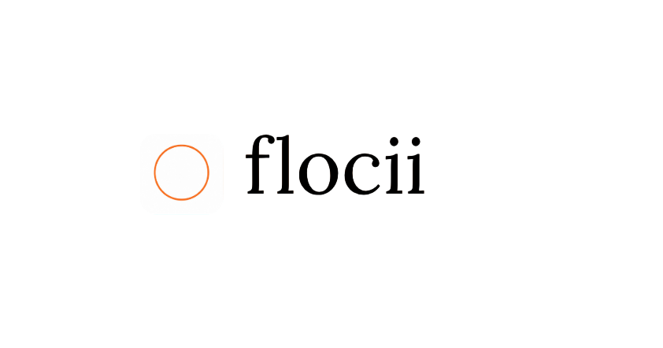

<p align="center">
  <picture>
    <source srcset="public/flocii-tm-dark.png" media="(prefers-color-scheme: dark)">
    <source srcset="public/flocii-tm-white.png" media="(prefers-color-scheme: light)">
    
  </picture>
</p>

<p align="center">
  <strong>Deep Work Protocol & Zen Focus Environment. Eliminate distractions, enter flow state, and master your time with procedural soundscapes.</strong>
</p>

<p align="center">
  <a href="https://flocii.heramb.icu">Live App</a> ·
  <a href="#core-features">Features</a> ·
  <a href="#soundscape--ambient-engine">Vibe Support</a> ·
  <a href="#getting-started">Quickstart</a> ·
  <a href="https://github.com/hebuildapps/flocii/issues">Issues</a>
</p>

<p align="center">
  <a href="https://flocii.heramb.icu"></a>
  <a href="https://github.com/hebuildapps/flocii/blob/main/LICENSE"></a>
  <a href="https://nextjs.org"></a>
  <a href="https://tailwindcss.com"></a>
</p>

<p align="center">
  <strong>Flocii for uninterrupted deep work in under 10 seconds.</strong><br/>
  <strong>Procedural Web Audio Engine · ASCII & Zen Canvas Visualizers · Micro-Goal Commitment Protocol</strong>
</p>

---

**Flocii** is an editorial-grade deep work web application designed to help developers, writers, and researchers achieve and sustain unbroken flow states.

Modern focus tools often clutter the screen with micro-management settings, distracting social feeds, or intrusive notifications. **Flocii** strips away friction: define a singular micro-goal, select an ambient environment or custom audio track, and enter a distraction-free full-screen zen cockpit.

| Feature | Details |
|---|---|
| 🎯 **Micro-Goal Commitment** | Set a singular intent and time duration before launching into a session to solidify mental focus. |
| 🎧 **Procedural Audio Engine** | Synthesizes real-time brown noise, rain physics, fire crackle, lo-fi drones, and tactile mechanical keystrokes directly in Web Audio API. |
| 🎨 **Dynamic Zen Visualizers** | Switch seamlessly between Fire, Rain, and custom ASCII canvas animation environments designed for low-distraction visual feedback. |
| 🎵 **YouTube Ambient Streamer** | Seamlessly layer custom YouTube audio URLs or lo-fi streams with procedural ambient sounds. |
| ⌨️ **Tactile Hotkeys & Shortcuts** | Fluid keyboard navigation (`Z` theme switch, `S` sound toggle, ambient track keys) built for keyboard-driven workflows. |
| 🏆 **Streak & Achievements** | Track completed focus sessions, earn milestone badges, and celebrate session victories with lightweight confetti effects. |
| ⚡ **Fullscreen Zen Cockpit** | Auto-enabling full-screen mode that turns your display into a zero-distraction focus terminal. |

---

## Use Flocii

<table>
<tr>
<td width="50%" valign="top">

### 🧘 I want to start a focus session

Enter deep work in seconds using the hosted web app. Define your goal, choose your soundscape, and flocii.

- Instant commitment timer & full-screen mode
- Multi-track procedural ambient mixer
- Session history & accomplishment badges

**[→ Launch Flocii App](https://flocii.app)**

</td>
<td width="50%" valign="top">

### 🖥️ Windows Desktop App

Dedicated distraction-free desktop window with zero browser navigation clutter.

- Standalone executable environment
- System-level keyboard shortcuts
- 100% offline local-first execution

**[→ Windows Desktop (Coming Soon)](#)**

</td>
</tr>
</table>

---

## How Flocii Works Under the Hood

```text
User Focus Request (Goal + Duration + Theme)
        ↓
   Flocii Engine
        │
        ├── 1. Zen Canvas Visualizer    Renders procedurally generated ASCII fire/rain frames
        ├── 2. Web Audio Synthesizer    Generates brown noise, rain, fire crackles & mechanical key clicks
        ├── 3. Custom YouTube Player    Streams secondary ambient/lo-fi audio via YouTube API
        ├── 4. Session State Tracker    Monitors countdown timer, handles pause/reset, & tracks metrics
        └── 5. Achievement Pipeline     Unlocks accomplishment badges & records session history locally
```

---

## Workspace Structure

```text
flocii/
├── src/
│   ├── app/                    # Next.js 15 App Router pages & layout
│   ├── components/             # Focus timer, session history, settings & visualizer components
│   │   └── landing/            # Landing hero, mechanics, audio test bench & FAQ
│   ├── hooks/                  # Keyboard shortcut listeners & custom React hooks
│   ├── lib/
│   │   └── zen/                # Web Audio synthesis engine & ASCII animation frame data
│   ├── types/                  # TypeScript definitions
│   └── visual-edits/           # Visual UI editor assets
├── public/                     # Static assets & trademark images
└── design.md                   # Brand visual identity & design system guidelines
```

---

## Getting Started

### Prerequisites

- **Node.js** 18+ (Node.js 20 recommended)
- **npm** 9+

### 1. Clone & Install

```bash
git clone https://github.com/hebuildapps/flocii.git
cd flocii
npm install
```

### 2. Run Locally

Start the local development server with Next.js Turbopack:

```bash
npm run dev
```

Open [http://localhost:3000](http://localhost:3000) in your browser.

### 3. Production Build

To test or build the production bundle:

```bash
npm run build
npm run start
```

---

## Soundscape & Ambient Engine

Flocii features a built-in zero-dependency procedural audio engine using the native **Web Audio API**:

- **Any YouTube video**: For deep,and personalised selection of choice for high-concentration coding and writing.
- **Rain**: White noise filtered through procedural gain modulation to emulate steady rainfall.
- **Fire place**: Random burst synthesis creating realistic ambient hearth crackles.

---

## Keyboard Shortcuts

| Key | Action |
|---|---|
| `num` | Toggle Zen Theme (Fire / Rain) |
| `S` | Toggle Master Sound |
| `Esc` | Exit Fullscreen |

---

## Privacy & Local-First Design

- **100% Client-Side Audio**: All procedural sounds are synthesized live in your browser's Web Audio engine. No audio files are downloaded or streamed from remote tracking servers.
- **Local Session Storage**: Focus history, achievement badges, and user preferences remain stored securely in your browser.
- **Zero Telemetry**: Flocii respects your focus and privacy with zero intrusive tracking analytics.

---

## Links

- 🌐 [Live Application](https://flocii.app)
- 🛡️ [Report an Issue](https://github.com/hebuildapps/flocii/issues)

---


